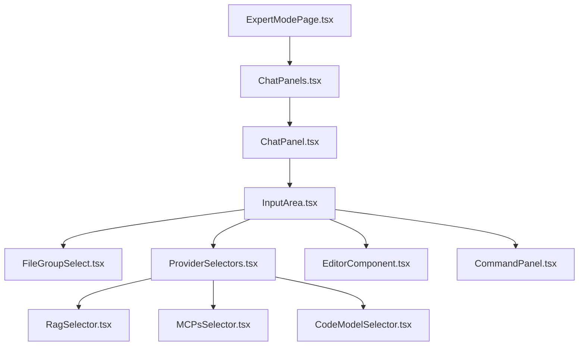

# auto-coder.web 项目结构

## 设置和分组面板

设置和分组面板是用户与系统交互的重要界面，用于选择文件组、配置RAG/MCP模式、切换编辑模式以及输入命令和提示等功能。整个面板遵循自上而下的组件层次结构，主要组件包括：

### 组件层次结构



### 组件功能描述

1. **ExpertModePage.tsx**: 专家模式的主页面，管理左侧聊天面板和右侧内容面板的布局
2. **ChatPanels.tsx**: 管理多个聊天面板（标签），允许用户在不同聊天上下文间切换
3. **ChatPanel.tsx**: 单个聊天面板，包含消息历史和输入区域
4. **InputArea.tsx**: 核心输入区域，整合所有用户输入相关组件
   - 提供模式切换（Chat/Write/Rule/Command）
   - 集成文件组选择、提供者选择和编辑器组件
   - 管理输入区域的最大化/最小化状态
5. **FileGroupSelect.tsx**: 文件组和单个文件选择组件
   - 支持选择预定义的文件组或单独的文件
   - 支持键盘导航和搜索
   - 显示当前上下文的token使用情况
6. **ProviderSelectors.tsx**: 集成多个模型和功能提供者选择器
   - **RagSelector.tsx**: 检索增强生成（RAG）功能的开关和配置
   - **MCPsSelector.tsx**: 多聊天协议（MCP）功能的开关和配置
   - **CodeModelSelector.tsx**: 代码模型选择和配置
7. **EditorComponent.tsx**: 基于Monaco的代码编辑器
   - 支持Markdown语法
   - 提供文件和符号的自动完成
   - 支持快捷键和各种编辑功能
8. **CommandPanel.tsx**: 命令模式的界面
   - 加载和执行预定义的命令文件
   - 支持命令变量的配置和预览

### 用户交互流程

```mermaid
sequenceDiagram
    参与者 User as 用户
    参与者 InputArea as 输入区域
    参与者 FileGroupSelect as 文件组选择
    参与者 Editor as 编辑器
    参与者 Backend as 后端服务
    
    User->>InputArea: 选择模式(Chat/Write/Rule/Command)
    
    alt 选择Command模式
        InputArea->>User: 显示命令面板
        User->>InputArea: 选择命令文件并设置变量
        InputArea->>Backend: 执行命令
    else 选择其他模式
        User->>FileGroupSelect: 选择文件组或文件
        FileGroupSelect->>Backend: 加载上下文(更新token计数)
        User->>Editor: 输入提示或命令
        alt 启用RAG或MCP
            InputArea->>Backend: 应用RAG/MCP增强
        end
        Editor->>Backend: 发送内容
    end
    
    Backend->>User: 返回结果
```

### 配置和状态管理

输入区域组件管理多种状态和配置：

1. **模式状态**:
   - isWriteMode: 编写模式（代码生成）
   - isRuleMode: 规则模式（应用预定义规则）
   - isCommandMode: 命令模式（使用预定义命令）

2. **功能开关**:
   - enableRag: 检索增强生成
   - enableMCPs: 多聊天协议
   - enableAgenticMode: 步进式代理模式
   - soundEnabled: 声音提示

3. **UI状态**:
   - isMaximized: 输入区域最大化
   - sendLoading: 发送状态
   - dropdownVisible: 下拉菜单显示状态

通过这些组件的协同工作，系统提供了灵活且强大的用户界面，使用户能够有效地与AI助手进行交互。


